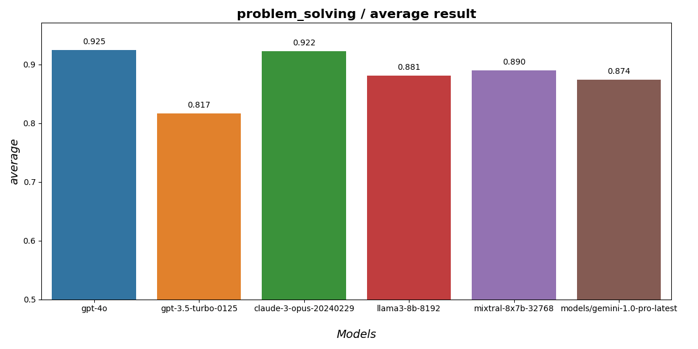
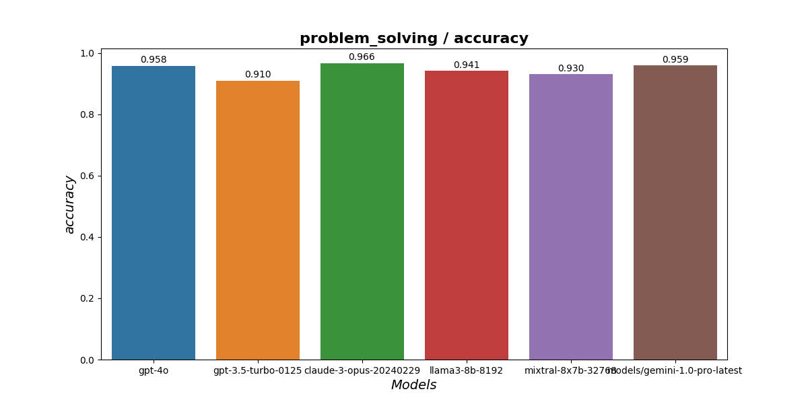
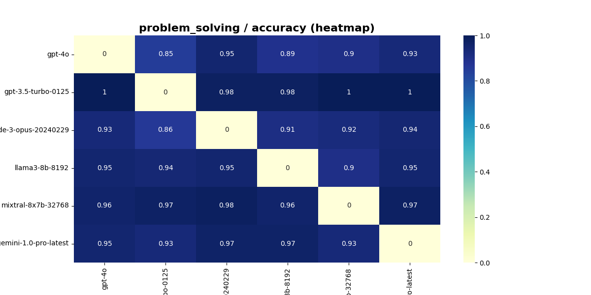
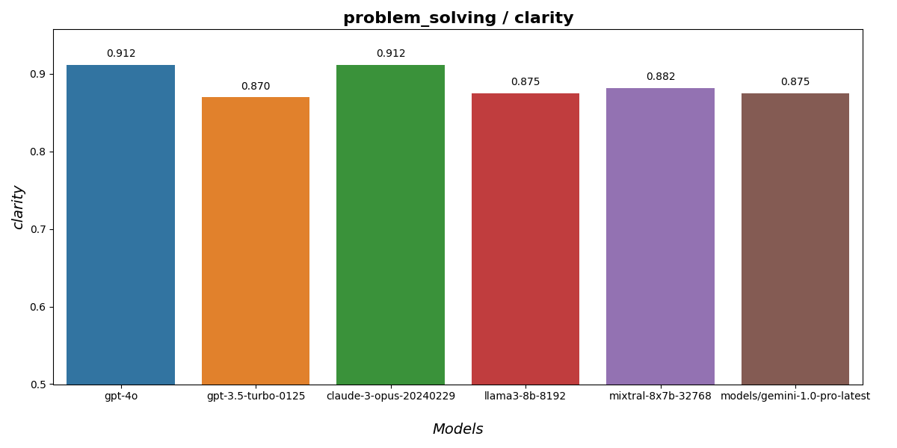
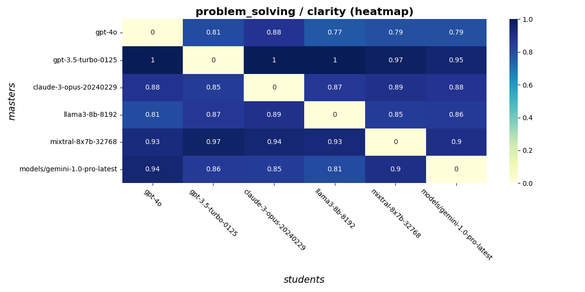
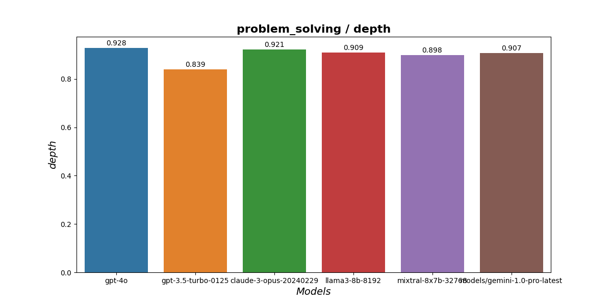
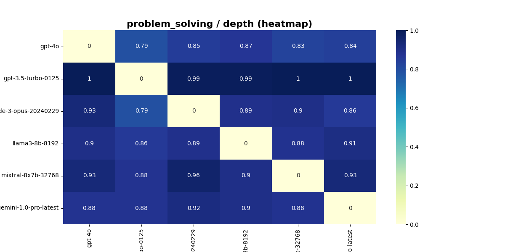

# RivaLLMatch

**RivaLLMatch** is an application that manages an arena in which different language models compete with each other. The basic concept is that models themselves evaluate each other.

The competition takes place in one of the following areas:

* problem-solving (implemented)
* creative writing (tbd)
* debate and persuasion (tbd)

## How it works

Evaluation within the area is carried out as follows.

### Round setup 

The number of rounds (n_rounds) in which all models (n_llms) participate is predetermined

### Tasks selection

Models select the problems or tasks they will solve in each round. Models are queried sequentially until the task pool is filled. Each model is queried an equal number of times only if the number of rounds matches the number of models.

### Task solving in rounds

In each round, models are paired for competition. Each pair consists of a 'master' (who evaluates) and a 'student' (who provides the answer). For example, if n_llms=3, there are 6 possible pairs.

### Master-student clash
The 'student' model answers a task from the round, and the 'master' model evaluates the response based on the following criteria:
* accuracy
* clarity
* depth of explanation
* reasoning

### Next round

After completing a round, the next task is selected, and another round begins.

### Results compilation

RivaLLMatch collects the results and generates charts for each metric and the overall average for each model at the end of the session. Additionally, heat maps are created to visualize how models evaluated each other.

## Problem-solving results

### Overall scores

### Accuracy

### Clarity

### Depth of explenation

### Reasoning

