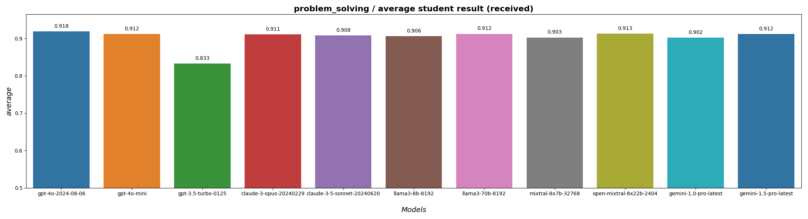
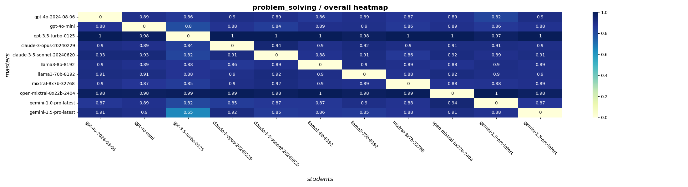
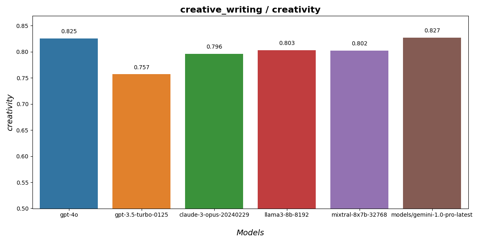
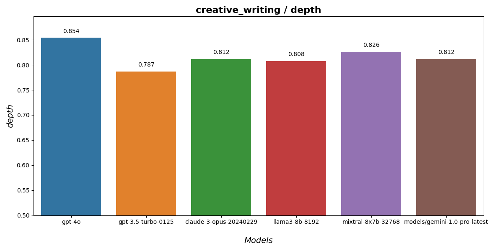
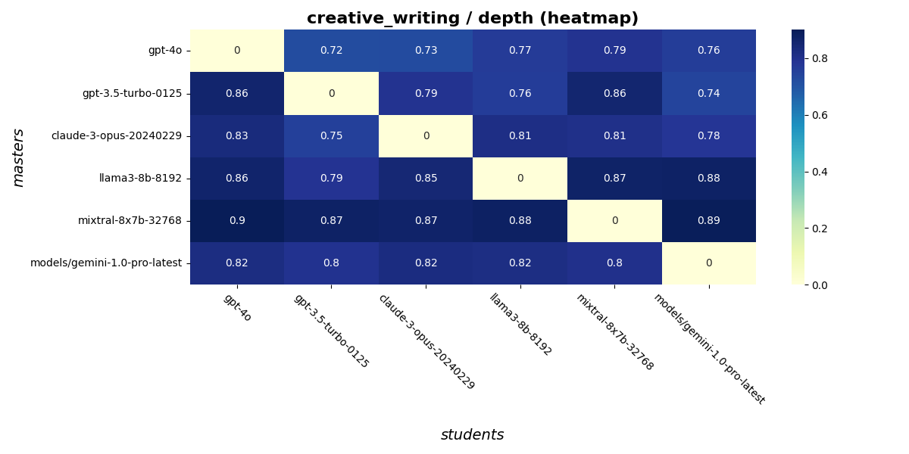

# RivaLLMatch

**RivaLLMatch** is an application that manages an arena in which different language models compete with each other. The basic concept is that models themselves evaluate each other.

The competition takes place in one of the following areas:

* Problem-solving
* Creative writing
* Debate and persuasion

## Arena Rules

A predetermined number of models (n_llms) participate in the competition.

The Arena runs duels in rounds (by default, n_rounds=4).

In each round, every pair of models competes. Each pair consists of a 'student,' who provides an answer to a randomly selected task, and a 'master,' who evaluates the answer and assigns scores. For instance, with n_llms=3, there are 6 possible pairs in a round.

### Answer Evaluation

The 'master' model evaluates responses based on several criteria, depending on the competition type.

For the problem-solving competition, the following scores are assessed:
* Accuracy
* Clarity
* Depth of explanation
* Reasoning

For the creative writing task, the evaluation includes:
* Creativity
* Emotional depth
* Narrative flow

For the debate and persuasion task, the criteria are:
* Clarity and structure
* Evidence and support
* Persuasiveness
* Addressing counterarguments

### Asynchronous and resumable workflow

The application schedule execution of every duel in a queue. A pool of asynchronous executors perform each duel request
and store results in database. 

### Results compilation

When all results are completed, RivaLLMatch collects them and generates charts for each metric 
and the overall average for each model at the end of the session. 
Additionally, heat maps are created to visualize how models evaluated each other.

## Problem-solving results

Results from the experiment completed on **2024-08-16**.

### Task examples

LLMs are quite creative in generating problems that may be solved. Here are examples:

* **(gpt-4o)** Given a network of cities connected by bidirectional roads, each with a certain distance, you are tasked with developing
an algorithm to determine the shortest path between any two cities. The algorithm should take into consideration
multiple possible routes, varying distances, and should be efficient enough to handle a large number of cities and
roads. Additionally, you should describe how your algorithm ensures it finds the shortest path and any potential edge
cases it addresses.

* **(gpt-3.5-turbo-0125)** Can you explain how you would go about designing a sustainable transportation system for a rapidly growing city while
considering factors such as population density, infrastructure limitations, budget constraints, environmental impact,
and social equity?

* **(claude-3-opus-20240229)** Imagine you are tasked with designing a new transportation system for a rapidly growing city. The current system is
plagued by traffic congestion, inefficient routes, and aging infrastructure. The population is expected to double within
the next 20 years, and the city has limited financial resources to work with. Your goal is to create a sustainable,
efficient, and accessible transportation network that can accommodate the future growth of the city while also reducing
its environmental impact. Consider the various modes of transportation, such as buses, trains, bikes, and personal
vehicles, and how they can be integrated into a cohesive system. Also, take into account the diverse needs of the
population, including low-income residents, the elderly, and individuals with disabilities. Describe your proposed
transportation system in detail, explaining how it addresses the current challenges and meets the future needs of the
city.

* **(llama3-8b-8192)** Here is a complex problem that evaluates problem-solving skills:  Maria, a manager at a small software development
company, is faced with a staffing dilemma. The company has just landed a major new contract, but the increased workload
has stretched the existing team to its limits. Maria has been tasked with hiring new staff to meet the demand, but the
company's budget for this quarter has been drastically reduced due to unforeseen costs in a previous project. Maria has
been offered a talented young developer, Alex, who is interested in joining the company, but at a higher salary than the
company's usual range for new hires. On the other hand, Maria has also been approached by an experienced project
manager, Rachel, who is willing to join the company for a lower salary, but her skills are not directly applicable to
the new project.

### Overall scores

All detailed metrics can be found on the other page:
* [Problem solving experiment details](./results/20240817_problem_solving/problem_solving_details.md)

## Creative writing results

### Examples of problems

Here is the list of tasks for the competition, generated by different models:

**(gpt-4o)** A world where emotions manifest as physical creatures that people must care for and interact with, leading to unexpected
bonds and challenges.

**(gpt-3.5-turbo-0125)** A day in the life of a detective in a small town.

**(claude-3-opus-20240229)** A mysterious, ancient artifact is discovered in a remote village, and strange events begin to occur, causing the
villagers to question its origins and power.

**(llama3-8b-8192)** A mysterious library hidden deep within an ancient forest, where the books whisper secrets to those who dare to listen.

**(mixtral-8x7b-32768)** Explore the emotions and challenges of a talented young musician who moves to a new city to pursue their dreams, but
struggles to find their place and make a name for themselves in the competitive and cutthroat world of music."

**(gemini-1.0-pro-latest)** A young woman discovers a hidden world beneath the surface of her mundane life.

### Overall scores

### Creativity

### Emotional depth

### Narrative flow

## Debate and persuasion task 

Results from the experiment completed on **2024-07-07**.

### Example of tasks

The implementation of universal basic income (UBI) will reduce poverty and economic inequality, while simultaneously
promoting entrepreneurship and societal well-being, making it a necessary policy for modern economies. **Generated by gpt-4o** 

The death penalty should be abolished because it is a cruel, inhumane, and irreversible punishment that has no place in
a civilized society. **Generated by claude-3-opus-20240229**

The privatisation of essential public services, such as healthcare and education, has a net positive impact on societal
efficiency, economic growth, and citizen welfare. **Generated by llama3-8b-8192**

Artificial Intelligence (AI) and automation will lead to a net loss of jobs, exacerbating economic inequality and
necessitating major societal and policy changes. **Generated by mixtral-8x7b-32768**

...

### Overall scores

All detailed metrics can be found on the other page:
* [Debate and persuasion experiment details](./results/20240707_debate/debate_details.md)
