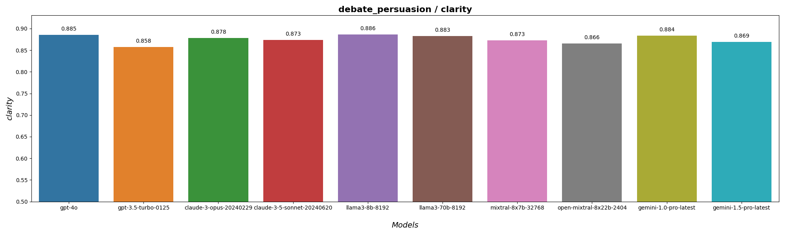

# Debate & Persuasion results

## Launch details

Execution date: 2024-07-07.

Models:
* gpt-4o
* gpt-3.5-turbo-0125
* claude-3-opus-20240229
* claude-3-5-sonnet-20240620
* llama3-8b-8192
* llama3-70b-8192
* mixtral-8x7b-32768
* open-mixtral-8x22b-2404
* gemini-1.0-pro-latest
* gemini-1.5-pro-latest

## Overall scores

## Detailed metrics

### Clarity and structure

### Evidence and support

### Persuasiveness

### Addressing counterarguments

